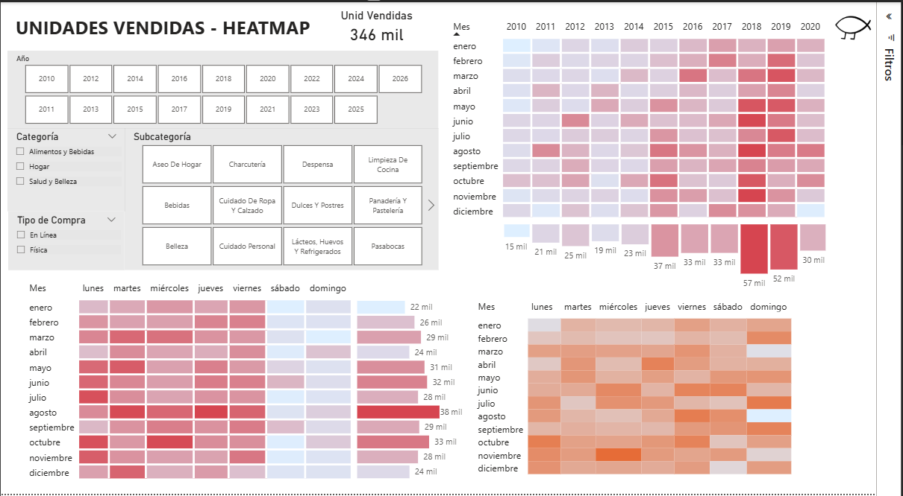

# Uso de Heatmap para Analisis Rapido  

## 📊 Dashboard Heatmap Ventas/Tiempo

Mediante este Dashboard y visualizacion Heatmap, podemos encontrar rapidamente patrones con datos masivos.
De un solo vistazo podemos realizar una exploracion interactiva, sumando dimensiones secundarias, llegando a
conclusiones rapidas con una comprension simple para tomar desiciones efectivas.
Adionalmente identificamos patrones y correlaciones, detectando zonas criticas/optimas, resaltando anomalias
con sus variables relacionadas.

## 🖼️ Vista previa

## 🚀 Tecnologías
- Power BI desktop.

##### Gabriel Gallardo
🔗 [LinkedIn Profile](https://www.linkedin.com/in/gerardo-gabriel-gallardo-12619ab5)
